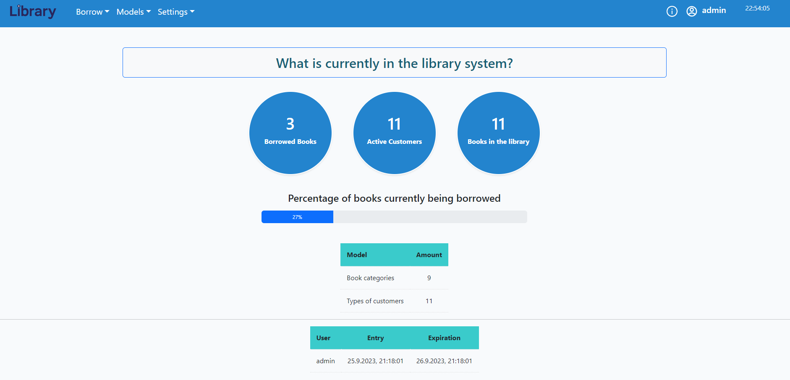

# Library

(https://library.razgoanizada.com/).  

## Description

This is a front-end project in React that introduces system management of a library.  
Through the system, you can manage your borrowed books to customers.  
You can also manage your books, customers and users.  
You can export the data to an Excel or PDF file.  
* The system is compatible with all types of devices.  

### `Permissions`

In the system you can find 3 types of permissions:  
Simple: can borrow books, manage the customer list and view the book list.  
Professional: In addition, can also manage the book list (add or edit / delete a book).  
Admin: full access to the system, can manage the list of users, the book categories and the customer types.  